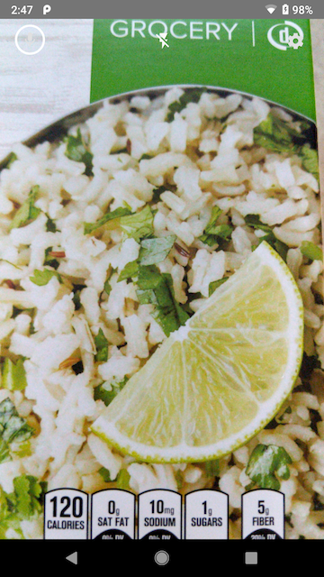

DMSDemo
=======

This sample app showcases the core Digimarc Mobile SDK (DMSDK) APIs.

## Introduction

DMSDemo uses ```CameraHelper``` and ```VideoCaptureReader``` to process camera preview frames and ```AudioCaptureReader``` to sample audio, detecting Digimarc Barcode (Product Packaging, Thermal Label, Print Media, and Audio), the most common 1D barcodes found in retail, and QR codes. Once detected, a code, referred to as ```Payload``` in the Digimarc Mobile SDK (DMSDK), is delegated to the Digimarc ```Resolver```, which queries Digimarc servers for additional information. The ```Resolver``` returns a ```ResolvedContent```, containing one or more ```ContentItem``` objects. Typically, developers will be interested in the content (generally an URL) associated with a ```ContentItem```. This sample uses the appropriate system intent to launch the content defined in the first ```ContentItem```. 
 
See the ```Payload``` documentation if you are interested in what information can be queried locally without using a ```Resolver```. This can include GS1 and GTIN related information to enable routing to your own product database.

## Prerequisites

You'll need a valid evaluation or commercial license key to use the core features of the app. Log in to your Digimarc Barcode Manager account to obtain your existing evaluation or commercial license key (https://portal.digimarc.net/). If your evaluation license is expired, please contact sales@digimarc.com to discuss obtaining a commercial license key.

## Screenshots



## Getting started

1. Open the project with Android Studio
1. Replace the license placeholder in src/main/res/values/strings.xml file with your license key. 
1. Run the app on a connected device using Android Studio or, alternatively, invoke gradle directly using ```./gradlew installDebug```.