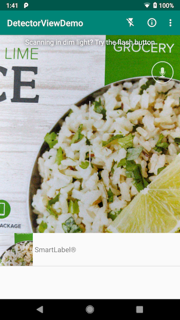

DetectorViewDemo
================

This sample app demonstrates usage of the Digimarc DetectorView component, a drop-in solution for mobile content detection of Digimarc Barcode, most common 1D barcodes, and QR codes. 

DetectorViewDemo is written entirely in Kotlin.

## Introduction

DetectorViewDemo processes camera preview frames and microphone audio samples, detecting Digimarc Barcode (Product Packaging, Thermal Label, Print Media, and Audio), the most common 1D barcodes found in retail, and QR codes. Once detected, a code, referred to as ```Payload``` in Digimarc Mobile SDK (DMSDK), is delegated to the Digimarc ```Resolver```, which queries Digimarc servers for additional information. The ```Resolver``` returns a ```ResolvedContent```, containing one or more ```ContentItem``` objects.

Detected codes and their first ```ContentItem``` are displayed in a list view. Image detections display a thumbnail of the preview frame, representing the data that was decoded. Audio detections download and display the image defined in the ```ContentItem```. When tapped, list items launch content using the appropriate intent.

```DMSDetectorView``` supports read regions, which limit the screen area used for reading. To enable the use of a read region along with a detect region screen overlay open the Views.kt source file, go to the initDis() method and uncomment the line that calls enableImageDetectionRegion(). This method creates a region in the center of the screen as well as enabling an overlay which highlights the read region in the camera display.

## Prerequisites

You'll need a valid evaluation or commercial license key to use the core features of the app. Log in to your Digimarc Barcode Manager account to obtain your existing evaluation or commercial license key (https://portal.digimarc.net/). If your evaluation license is expired, please contact sales@digimarc.com to discuss obtaining a commercial license key.

## Screenshots



## Getting started

1. Open the project with Android Studio
1. Replace the license placeholder in src/main/res/values/strings.xml file with your license key. 
1. Run the app on a connected device using Android Studio or, alternatively, invoke gradle directly using ```./gradlew installDebug```.